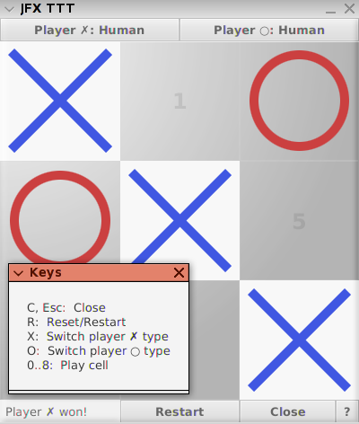

JavaFX TicTacToe
===

The first personal project to learn JavaFX 8.

## Webstart Build 

`$ javapackager -createjar -appclass net.eseb.jfxttt.Main -srcdir bin -outdir compiled -outfile jfxttt -v -manifestAttrs "Application-Name=JFXTTT,Created-By=AUTHOR,Permissions=sandbox"`
OR
`$ javapackager -createjar -appclass net.eseb.jfxttt.Main -srcdir bin -outdir compiled -outfile jfxttt -v -manifestAttrs "Application-Name=JFXTTT,Created-By=AUTHOR,Permissions=sandbox,Codebase=http://localhost/jfxhw/ http://127.0.0.1/jfxhw http://HOSTNAME.DOMAIN.TLD/jfxttt"`

`$ jarsigner compiled/jfxttt.jar ALIAS`

`$ javapackager -deploy -appclass net.eseb.jfxttt.Main -srcdir compiled -outdir deployed -outfile index -width 400 -height 450 -name JFXTTT -v`

If no `Codebase` property in `MANIFEST.MF` in jar file, add `codebase` attribute to `jnlp` element in jnlp file:

index.jnlp:

    <?xml version="1.0" encoding="utf-8"?>
    <jnlp spec="1.0" xmlns:jfx="http://javafx.com" href="index.jnlp" codebase="http://localhost/jfxttt">
      <information>
        <title>Sample JavaFX Application</title>
        <vendor>Unknown vendor</vendor>
        <description>Sample JavaFX 2.0 application.</description>
        <offline-allowed/>
      </information>
      <resources>
        <j2se version="1.6+" href="http://java.sun.com/products/autodl/j2se"/>
        <jar href="jfxttt.jar" size="23948" download="eager" />
      </resources>
      <jfx:javafx-desc  width="400" height="450" main-class="net.eseb.jfxttt.Main"  name="JFXTTT" />
      <update check="background"/>
    </jnlp>

If the jar is self signed, the domain serving it needs to be white-listed in the Java Control Panel (accessible from `javaws -viewer`).

